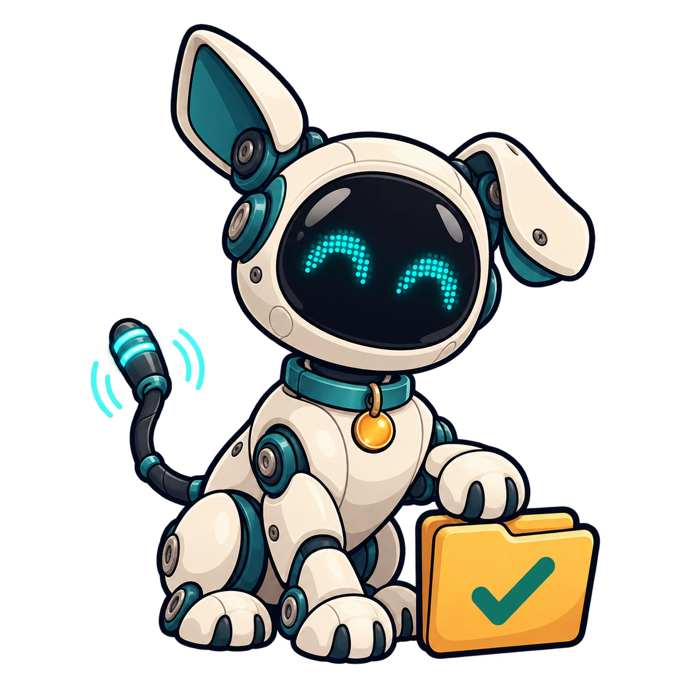

<p align="center">
  
</p>

<h1 align="center">Goddard</h1>

<p align="center"><strong>Your coding agent's best friend. Good dog. Great handoffs.</strong></p>

<p align="center">
  <a href="https://github.com/kggayo/goddard/actions/workflows/ci.yml"></a>
  <a href="https://github.com/kggayo/goddard/releases/latest"></a>
  <a href="LICENSE"></a>
  
  <a href="CONTRIBUTING.md"></a>
</p>

Your agent is halfway through a fix. The tests are almost green. Then:

> You've reached your usage limit. Come back later.

Now you can wait, or open another agent and explain the whole project again. Where were we? What changed? Which tests ran? Was that command finished?

**Goddard carries the work in progress to the next session.** It runs Codex or Claude Code, asks for progress checkpoints, saves workspace evidence, and hands the next account or agent a recovery brief. Less retelling. More finishing.

**Early release · v0.3.0.** The core is working; real-world reports and small improvements are very welcome.

## Take it for a walk

You'll need **Node.js 24+**, **Git**, and either [Codex CLI](https://learn.chatgpt.com/docs/cli) or [Claude Code](https://code.claude.com/docs/en/quickstart) installed. If you're already signed in, Goddard can reuse that login.

```sh
npm install --global https://github.com/kggayo/goddard/releases/latest/download/goddard.tgz
goddard --version
goddard doctor
```

That's it—no checkout or npm account needed. The same package works on Windows, macOS, and Linux. It includes Goddard's runtime dependencies; Node.js and the coding CLIs are installed separately. [Install, update, uninstall, and troubleshooting →](docs/installing.md)

Not signed in yet? Run `goddard login main --agent codex` (or `--agent claude`) and complete the provider's normal login flow.

Now go to the project you want to work on:

```sh
cd path/to/your-project
goddard init
goddard new "Fix the login bug and run the relevant tests"
```

Copy the task ID printed by `new`, then choose your agent:

```sh
goddard run TASK_ID --agent codex --effort high
# Or:
goddard run TASK_ID --agent claude --model sonnet --effort medium
```

Chat, answer questions, and approve requests in Goddard's terminal. After a turn, type a follow-up or `/done` to finish. **Ctrl+C** asks for a checkpoint and stops; a second press stops immediately. Existing provider permissions still apply.

No model account handy? Try the recovery demo from a source checkout:

```sh
git clone https://github.com/kggayo/goddard.git
cd goddard
npm ci
npm run demo
```

It simulates an interrupted Codex run and a Claude handoff. No login or model quota needed. `npm run preview` gives the terminal styling a spin.

<details>
<summary>Prefer to skip the global command?</summary>

From a source checkout, use `node /absolute/path/to/goddard/bin/goddard.js` instead of `goddard`, or run `npm link` to use your development copy globally. On Windows, use the native Codex/Claude executable; see the [full guide](docs/usage.md#get-started).

</details>

## More accounts, less waiting

Account selection and quota failover are **on by default**. Keep your current login and add another account once:

```sh
goddard login work --agent codex
goddard login personal --agent codex

# The same works with Claude:
goddard login work --agent claude
goddard accounts --agent claude --probe
```

Run the task normally. Goddard selects a profile that isn't known to be unavailable. If it reaches the quota threshold, Goddard saves the handoff, stops the old process, and tries the next profile of that agent. Explicit model, effort, and permission settings carry over.

Want to move between coding agents? That's one explicit command:

```sh
# After the old run has stopped:
goddard run TASK_ID --agent claude
```

Use `--account work` to pin a profile, or `--no-failover` to select automatically but stop at its limit. Existing profile folders are discovered too. [Account setup and selection details →](docs/usage.md#automatic-account-selection)

<details>
<summary>Unlimited power? Well…</summary>

<p align="center"></p>

The vibe: unlimited power. The feature: fewer interrupted coding sessions. 🐾

More available accounts can keep a task moving longer. Goddard doesn't create credits, reset quotas, or guarantee unlimited usage. Each account still needs valid access and available capacity, and provider terms still apply. If every profile is unavailable, Goddard stops with the handoff saved.

The meme is a third-party reference, not part of the MIT-licensed code. [Artwork credits](docs/assets/README.md).

</details>

## What the good dog actually carries

| Saved for the next session | Why it helps |
| --- | --- |
| Goal and your clarifications | The next agent knows what you asked for |
| Plan, decisions, completed work, next steps | It can pick up the implementation |
| Test results and recent tool evidence | It can check what was actually verified |
| Operations with uncertain results | It knows what to inspect before retrying |
| Workspace changes and file snapshots | The work survives the stopped process |

Goddard forwards a **structured checkpoint and bounded recent evidence**, not an exact replay of every message or private model state. Checkpoints are best effort, file capture has exclusions, and the next agent should verify the current state before continuing. [Recovery details](docs/usage.md#recovery-and-portability).

## Who can ride along?

| Agent / integration target | Status |
| --- | --- |
| Codex CLI | Available: managed sessions, interaction, quota checks, account failover |
| Claude Code | Available: managed sessions, interaction, account failover; quota visibility depends on emitted events |
| DeepSeek | Roadmap: investigate an adapter |
| Muse | Roadmap: confirm the intended product and integration interface |
| Kimi | Roadmap: investigate an adapter |
| Grok | Roadmap: investigate an adapter |
| Gemini | Roadmap: investigate an adapter |

Future entries are ideas, not supported providers or release promises. The first job is confirming an interface that can preserve progress and handle permissions honestly. [See the roadmap](ROADMAP.md) or [propose an integration](https://github.com/kggayo/goddard/issues/new?template=feature_request.yml).

## Come build with us

First open-source contribution? You're welcome here. A confusing sentence, a reproducible bug, a Windows/Linux/macOS report, or a small fix all count. You don't need a grand new feature.

- **Something broke?** [Report a bug](https://github.com/kggayo/goddard/issues/new?template=bug_report.yml).
- **An idea or question?** [Start a discussion](https://github.com/kggayo/goddard/discussions).
- **Ready to change something?** Follow the [first-PR guide](CONTRIBUTING.md).
- **Found a security issue?** Please use [private reporting](SECURITY.md).

The usual path is **fork → branch → small change → pull request**. Anyone can propose a change. Maintainers review and merge it; you don't need to be added as a collaborator first.

## The handy drawer

- [Full usage guide](docs/usage.md): login, models, effort, interaction, profiles, recovery, and all commands.
- [Installation guide](docs/installing.md): packages, updates, and troubleshooting.
- [Roadmap](ROADMAP.md): current scope and future adapters.
- [Contributing](CONTRIBUTING.md): local development and your first pull request.
- [Maintainer guide](docs/maintaining.md): how repository access and reviews work.
- [Code of conduct](CODE_OF_CONDUCT.md): be kind to the humans behind the terminals.

## Why “Goddard”?

An affectionate nod to Jimmy Neutron's robot dog: a clever little companion who helps when an experiment gets complicated. The README features the supplied image of our namesake. Goddard is an independent community project, with no affiliation or endorsement from the show or the coding-agent providers.

Code and documentation are [MIT licensed](LICENSE). The Jimmy Neutron mascot image and movie meme are third-party artwork excluded from that license; see [third-party notices](THIRD_PARTY_NOTICES.md) and [artwork credits](docs/assets/README.md).
